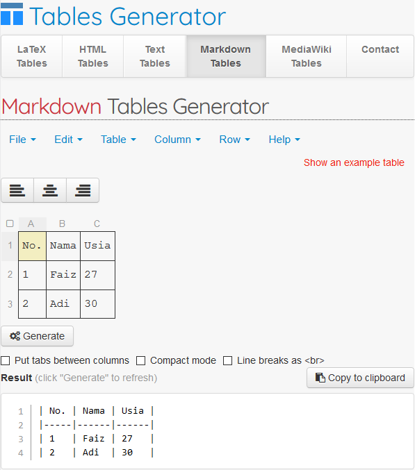
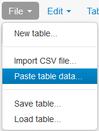
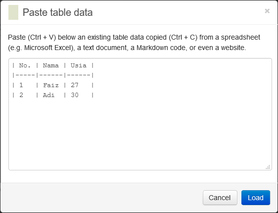
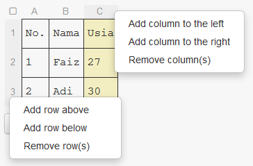

`Anda berada di dalam panduan: Markdown`


Secara umum, inilah detil teknis yang dapat kalian lakukan dengan Markdown:
<AUTOGENERATED_TABLE_OF_CONTENTS>

## Manfaat

1. Kemudahan distribusi karena tidak dalam bentuk dokumen
2. Menghemat waktu dan fokus ke dalam konten karena tidak perlu memikirkan format tampilan

## Tools yang Dibutuhkan

Silahkan dipilih berdasarkan preferensi kalian:
1. **Editor Teks** (Notepad++ / Visual Code / Sublime Text / dll)
2. **Editor Diagram** (Alamat: http://draw.io)
3. **Editor Gambar** (Apa saja yang terpenting mendukung penyimpanan gambar dalam format`.svg`)
4. **Editor Tabel** (Alamat: https://tablesgenerator.com/markdown_tables)

## Struktur Halaman Markdown

> Dibawah ini adalah template awal Markdown, silahkan salin ke dalam [Editor Teks](markdown#tools-yang-dibutuhkan) kalian.

Sebagai contoh:
<!--DOCUSAURUS_CODE_TABS-->

<!--Template Awal-->
```markdown
---
id: cobanulis
title: Panduan Menulis Markdown
---
`Anda berada di dalam panduan: Markdown`

## Header Awal

Isi paragraf 1

## Header Kedua

Isi paragraf 2

### Sub Header

Isi paragraf 3
```

<!--Contoh Lain-->
```markdown
---
id: cobanulis
title: Spesifikasi
---
`Anda berada di dalam panduan: PMCS`

Perhatikan kebutuhan spesifikasi perangkat sebelum melakukan instalasi PMCS.


## Kebutuhan Perangkat Lunak

Aplikasi berikut wajib sudah terpasang sebelum instalasi:
1. **Visual C++ 2013 Redistributable Package**: program dari Microsoft untuk mendukung aplikasi PMCS, unduh [disini](http://e-accounting.wika.co.id/pmcs/files/vcredist.zip) dan install keduanya
2. **Firefox**: _browser_ yang direkomendasi karena kompatibilitas _plugin_ untuk melihat laporan, unduh [disini](https://www.mozilla.org/en-US/firefox/all/)
3. **Microsoft Excel**: membantu proses input data, kompatibel dengan PMCS apabila dapat menyimpan dokumen .xls

Aplikasi tidak wajib namun membantu proses:
- **Adobe Acrobat Reader DC**: untuk membaca dokumen PDF, unduh [disini](https://get.adobe.com/reader/)

*[PMCS]: Project Monitoring & Control System
```

<!--END_DOCUSAURUS_CODE_TABS-->

Simpan file dengan nama `cobanulis.md`. Konten contoh ini hanya berlaku untuk 1 halaman, buat file yang berbeda untuk halaman lain.

Berdasarkan contoh template diatas, beberapa baris awal kita anggap sebagai **pra-konten** yang dipisahkan dengan simbol `---`. Isinya adalah:

```markdown
---
id: cobanulis
title: Panduan Menulis Markdown
---
`Anda berada di dalam panduan: Markdown`
```

- `id`: Diisi nama file
- `title`: Judul halaman awal

Baris selanjutnya dapat kita sebut sebagai **konten**. Isinya:

```markdown
## Header Awal

Isi paragraf 1

## Header Kedua

Isi paragraf 2

### Sub Header

Isi paragraf 3
```

> **Konten** tidak perlu diisi sama persis dengan contoh, dapat dikreasikan sesuai keinginan kalian.

## Merubah Isi Konten

Mari kita bedah satu per satu supaya lebih mudah. Simak beberapa contoh berikut ini.

### `Menulis Judul Header`

```markdown
# Judul Header 1
## Judul Header 2
### Judul Header 3
#### Judul Header 4
##### Judul Header 5
###### Judul Header 6
```
Menghasilkan ini:

#### Contoh Judul Header 4
##### Contoh Judul Header 5

### `Menulis Teks Tebal`

```markdown
Ini hasil cetak **Tebal** ya guys.
```

Menghasilkan ini:

Ini hasil cetak **Tebal** ya guys.

### `Menulis Teks Miring`

```markdown
Ini hasil cetak _Miring_ ya guys.  
Kalau ini contoh kombinasi cetak **Tebal dan _Miring_** ya.
```

Menghasilkan ini:

Ini hasil cetak _Miring_ ya guys.  
Kalau ini contoh kombinasi cetak **Tebal dan _Miring_** ya.

### `Menulis Teks Coret`

```markdown
Ini hasil cetak ~~Coret~~ ya guys.
```

Menghasilkan ini:

Ini hasil cetak ~~Coret~~ ya guys.

### `Membuat Daftar/List`

Dalam contoh ini, spasi awal dan akhir ditampilkan dengan tanda `⋅`.

```markdown
1. Item daftar bernomor pertama
2. Item lain
⋅⋅⋅* Sub-daftar tidak bernomor
1. Angka tidak berurutan tidak masalah, secara otomatis nomor akan diurutkan
⋅⋅⋅1. Sub-daftar bernomor
⋅⋅⋅2. Sub-daftar bernomor
4. Dan item lainnya

⋅⋅⋅Kalian dapat membuat paragraf yang menjorok ke dalam di daftar item. Perhatikan baris kosong di atas, dan spasi di awal kalimat (setidaknya boleh diisi satu spasi saja, tapi saya menggunakan tiga spasi di sini).

⋅⋅⋅Untuk membuat jeda baris tanpa paragraf, dapat menggunakan dua spasi tambahan.⋅⋅
⋅⋅⋅Perhatikan bahwa baris ini terpisah, tapi masih dalam paragraf yang sama.

* Daftar tidak bernomor dapat menggunakan tanda bintang
- Atau minus
+ Atau plus
```

Menghasilkan ini:
1. Item daftar bernomor pertama
2. Item lain
   * Sub-daftar tidak bernomor
1. Angka tidak berurutan tidak masalah, secara otomatis nomor akan diurutkan
   1. Sub-daftar bernomor
   2. Sub-daftar bernomor
4. Dan item lainnya

   Kalian dapat membuat paragraf yang menjorok ke dalam di daftar item. Perhatikan baris kosong di atas, dan spasi di awal kalimat (setidaknya boleh diisi satu spasi saja, tapi saya menggunakan tiga spasi di sini).

   Untuk membuat jeda baris tanpa paragraf, dapat menggunakan dua spasi tambahan.  
   Perhatikan bahwa baris ini terpisah, tapi masih dalam paragraf yang sama.

* Daftar tidak bernomor dapat menggunakan tanda bintang
- Atau minus
+ Atau plus

Jika kalian ingin mencobanya silahkan salin teks berikut ini:

```markdown
1. Item daftar bernomor pertama
2. Item lain
   * Sub-daftar tidak bernomor
1. Angka tidak berurutan tidak masalah, secara otomatis nomor akan diurutkan
   1. Sub-daftar bernomor
   2. Sub-daftar bernomor
4. Dan item lainnya

   Kalian dapat membuat paragraf yang menjorok ke dalam di daftar item. Perhatikan baris kosong di atas, dan spasi di awal kalimat (setidaknya boleh diisi satu spasi saja, tapi saya menggunakan tiga spasi di sini).

   Untuk membuat jeda baris tanpa paragraf, dapat menggunakan dua spasi tambahan.  
   Perhatikan bahwa baris ini terpisah, tapi masih dalam paragraf yang sama.

* Daftar tidak bernomor dapat menggunakan tanda bintang
- Atau minus
+ Atau plus
```

### `Menambahkan Gambar`

```markdown

```

Mari pisah menjadi 3 bagian, kalian cukup merubah isi yang diawali dan diakhiri dengan tanda petik `"`:
- `src`: Diisi nama file gambar setelah `assets/`  
   (jika kalian punya referensi gambar dari web lain, boleh mencantumkan link utuhnya. contoh: `src="http://faizadi.github.io/wika-guide/docs/assets/undraw_teacher_35j2.svg"`)
- `alt`: Alternatif teks yang muncul apabila gambar gagal dimuat oleh browser
- `width`: Ukuran lebar gambar dalam pixel

Menghasilkan ini:


Format gambar disarankan menggunakan `.svg`. Walaupun format `.png` dan `.jpg` juga didukung.

### `Menambahkan Link`

URL atau link yang ditulis secara utuh otomatis menjadi hyperlink.

Contoh:

```markdown
Silahkan menuju halaman: http://faizadi.github.io atau faizadi.github.io
```

Menghasilkan ini:

Silahkan menuju halaman: http://faizadi.github.io atau faizadi.github.io

Apabila kalian ingin agar URL atau link tidak menampilkan alamat mentah, simak contoh dibawah ini:

```markdown
Ini adalah [inline-style link](http://faizadi.github.io)

Ini adalah [inline-style link dengan title](http://faizadi.github.io "Sebuah situs")
```

Menghasilkan ini:

Ini adalah [inline-style link](http://faizadi.github.io)

Ini adalah [inline-style link dengan title](http://faizadi.github.io "Sebuah situs")

### `Membuat Tabel`

#### Menambahkan Tabel

> Kalian dapat menggunakan [Editor Tabel](markdown#tools-yang-dibutuhkan) untuk mempermudah pembuatan tabel.



Langkah-langkah sesuai gambar diatas:
1. Pastikan kalian berada pada tab Markdown Tables
2. Isi tabel seperti mengisi Excel, lihat warna kuning pada gambar
3. Klik tombol `Generate` untuk menghasilkan output dalam markdown
4. Klik tombol `Copy to Clipboard` untuk menyalin
5. Tempel teks tersebut ke dokumen markdown kalian

```markdown
| No. | Nama | Usia |
|-----|------|------|
| 1   | Faiz | 27   |
| 2   | Adi  | 30   |
```

Menghasilkan ini:

| No. | Nama | Usia |
|-----|------|------|
| 1   | Faiz | 27   |
| 2   | Adi  | 30   |

#### Memodifikasi Tabel

1. Pada [Editor Tabel](markdown#tools-yang-dibutuhkan), klik tombol `File`. Pilih `Paste table data`. 

   

2. _Copy_ dan _Paste_ isi tabel yang ingin kalian ubah pada kolom yang tersedia. Klik tombol `Load`.

   

3. Apabila ingin menambah kolom atau baris, klik kanan pada kepala kolom atau baris.  
   Pilih `add column ..` untuk kolom dan `add row ..` untuk baris.

   

4. Ulangi langkah pengisian [berikut ini](markdown#menambahkan-tabel).

5. Atau... kalian bisa langsung mengedit tabel pada [Editor Teks](markdown#tools-yang-dibutuhkan) apabila sudah menguasai bahasa markdown dan tidak perlu mengikuti tutorial ini.

## Playground

Jika ingin belajar menulis, kalian bisa coba-coba menulis **konten** disini:

<iframe src="https://markdown-here.com/livedemo.html" width="760" height="1100" scrolling="no"></iframe>

## Selesai

Jika ingin dibuatkan halaman khusus spesifik untuk aplikasi yang kalian tangani, silahkan buat akun [Github melalui link ini](https://github.com/join?source_repo=faizadi%2Fwika-guide). Kemudian konfirmasi melalui email ke faiz@wikamail.id dengan menyertakan:

```markdown
Nama Aplikasi: (Contoh: PMCS)

Jumlah Halaman: (1/2/3/dst)
Nama File dengan prefix aplikasi: (Contoh pmcs adalah `pmcs_ininamafile` tanpa spasi)
Judul Halaman: (Contoh: Panduan Menulis Markdown)
Username Github-mu: 

NOTE: Apabila jumlah halaman lebih dari satu,  
      harap menyertakan Nama File dan Judul Halaman untuk masing-masing halaman.
```

Setelah itu tunggu balasan email untuk petunjuk selanjutnya. Selamat menulis juklak!

> Catatan: Kegiatan mem-_publish_ isi konten ke situs web hanya dilakukan oleh Admin.
