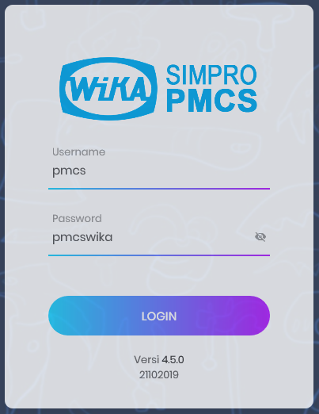
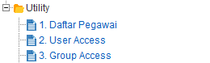
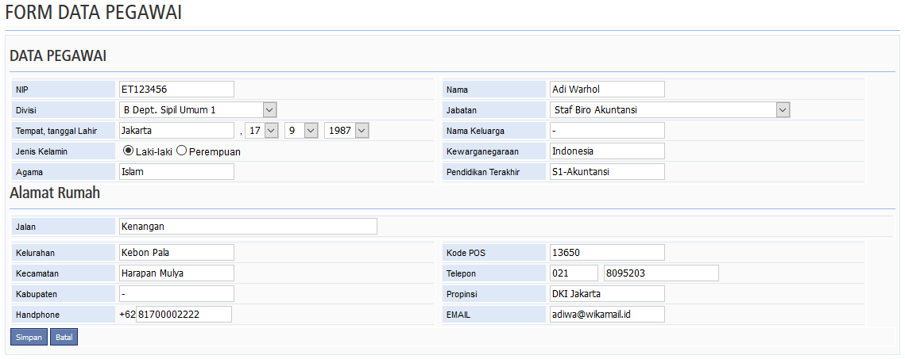
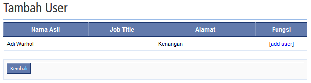
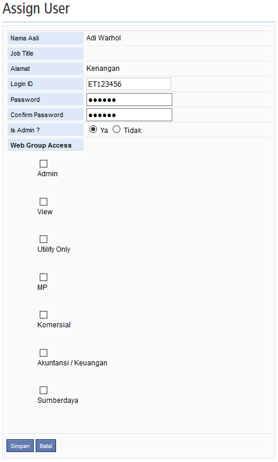
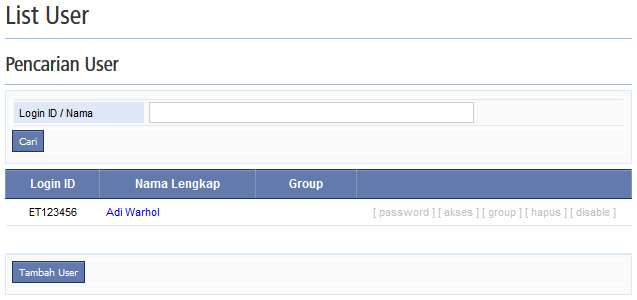

`Anda berada di dalam panduan: PMCS`

## Login Awal

PMCS adalah aplikasi offline sehingga pengelolaan akun diserahkan kepada masing-masing unit kerja proyek. Perhatikan gambar dibawah, masukan _Username_ dan _Password_ tersebut untuk _Login_ pertama kali.

> **NOTE**: Akun tersebut hanya digunakan untuk membuat dan memberikan akses _Login_. Tidak dapat digunakan untuk operasional, karena akses menu sangat terbatas pada menu `Utility`.

## Menambah Akun

1. Setelah login, klik `Utility` di bagian kiri, kemudian buka menu `Daftar Pegawai`.

    

2. Klik tombol `Tambah Pegawai`. Isi form lalu klik tombol `Simpan` saat telah selesai.

    

3. Buka menu `User Access`. Klik tombol `Tambah User`. Kemudian Klik `add user` untuk menambah akses pegawai.

    

4. Isi form lalu klik tombol `Simpan` saat telah selesai.

    

> _Web Group Access_ tidak perlu dicentang sama sekali apabila sudah memilih **Ya** di `Is Admin`.

5. Klik tombol `Kembali`, apabila tampil seperti gambar dibawah maka proses selesai.

    

6. _Logout_, kemudian _Login_ kembali dengan akun yang baru dibuat. Selesai.

## Video Tutorial Membuat Akun

<video width="100%" controls>
  <source src="https://e-accounting.wika.co.id/pmcs/files/PMCS-CaraBuatID.mp4" type="video/mp4">
  Browser Anda tidak mendukung format video ini.
</video>

*[PMCS]: Project Monitoring & Control System
