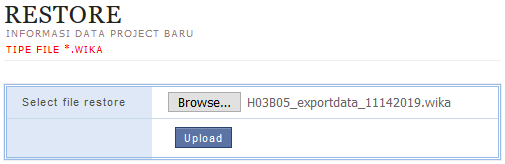

`Anda berada di dalam panduan: PMCS`

Data Master berisi data-data inisiasi proyek yang dibutuhkan PMCS:
1. Data SPK: Deskripsi Proyek, OK, Tanggal Mulai & Akhir Proyek
2. Data Nasabah Wika
3. Data Perkiraan
4. Data Akun Bank dan Kode Bank
5. Kode Master Sumberdaya

> Kapan data master dibutuhkan?
> 1. Saat awal pengoperasian PMCS
> 2. Ketika terdapat pembaruan data (contoh: Pembaruan tanggal rencana selesai)

## Alur Mendapatkan Data Master

 **ENTITAS**:
- PROYEK = Tim Proyek
- DEPARTEMEN = [PIC SIMDIV Departemen](pmcs_poc#informasi)

 _Bantu saya mengkoreksi kesalahan gambar? Unduh [disini](../assets/pmcs/drawio_aluruplmaster.drawio)_.

## Seperti apa wujud file Data Master itu? 

Setelah mendapatkan _file_ yang dimaksud dari departemen masing-masing, langkah selanjutnya yaitu memastikan validitas data master dengan melihat nama _file_.

| DETIL NAMA _FILE_ | KETERANGAN |
|-------------------|-----------------------------------|
| `H03B05` | Kode proyek |
| `exportdata` | Hanya keterangan |
| `11242019` | Tanggal data diekspor dari sistem |
| `.wika` | Ekstensi data master yang valid |

## Panduan Upload Data Master

1. Buka menu `Restore Informasi Project(SPK)`.

    

2. Pilih _file_ master melalui tombol `Browse`. Kemudian klik tombol `Upload` untuk memulai input.

    

> Perhatikan format ekstensinya, apabila bukan berakhiran `.wika` silahkan hubungi kembali [PIC SIMDIV Departemen](pmcs_poc#informasi) guna mendapatkan _file_ yang tepat.

## Bagaimana memastikan data master sudah masuk PMCS?

<!--DOCUSAURUS_CODE_TABS-->
<!--Proyek Baru-->
 
Buka menu `Dashboard`.

- Contoh gambar ==sebelum== data master masuk

    

- Contoh gambar ==setelah== data master masuk

    

<!--Proyek Berjalan-->
 
Buka menu `Dashboard`. Pilih salah satu proyek.

- Contoh gambar ==sebelum== rencana tanggal selesai data berubah

    

- Contoh gambar ==setelah== rencana tanggal selesai data berubah

    

<!--END_DOCUSAURUS_CODE_TABS-->

## Video Tutorial Memperbarui Data Master

<video width="100%" controls>
  <source src="https://e-accounting.wika.co.id/pmcs/files/PMCS-CaraUplMaster.mp4" type="video/mp4">
  Browser Anda tidak mendukung format video ini.
</video>

*[PMCS]: Project Monitoring & Control System
*[OK]: Omzet Kontrak
*[SIMDIV]: Sistem Informasi Manajemen Divisi
*[PIC]: Person In Charge
*[SPK]: Surat Perintah Kerja
