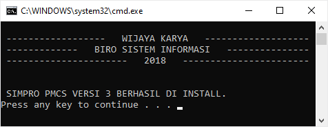

`Anda berada di dalam panduan: PMCS`

Perhatikan alur proses instalasi yang dibagi sesuai fungsi.

## Alur Instalasi

 **ENTITAS**:
- PROYEK = Tim Proyek
- M.AKP = Manajer Akuntansi dan Pajak
- BSI = Biro Sistem Informasi

 _Bantu saya mengkoreksi kesalahan gambar? Unduh [disini](../assets/pmcs/drawio_alurinstal.drawio)_.

## Panduan Instalasi

> Tahap ini cukup dijalankan **1 kali**. Pastikan telah memasang [daftar aplikasi](pmcs_spec#kebutuhan-perangkat-lunak) yang dibutuhkan PMCS.

1. Siapkan _installer_ aplikasi PMCS, unduh melalui alamat [e-accounting.wika.co.id/pmcs](http://e-accounting.wika.co.id/pmcs).
2. Klik kanan _installer_, pilih `Run as administrator`.

  

3. Tunggu proses instalasi hingga selesai. Estimasi hingga 5-10 menit tergantung spesifikasi laptop/komputer.

  

4. Diharap tidak menekan tombol `Close` sebelum tampil tulisan ==Press any key to continue . . .== Tekan tombol `Enter` setelah tampil tulisan tersebut.

  

5. Lanjut, tekan tombol `Enter` kembali.

  

6. Selesai. Tekan tombol `Close`. Silahkan beralih ke [tahap selanjutnya](pmcs_install#panduan-patch).

  

## Panduan Patch

1. Unduh patch melalui alamat: [e-accounting.wika.co.id/pmcs](http://e-accounting.wika.co.id/pmcs).
2. Klik kanan pilih `Extract Here`.

  

3. Buka folder Patch PMCS. Jalankan program, klik kanan pilih `Run as administrator`.

  

4. Lakukan ini apabila terhadang antivirus (opsional).

    Klik tombol `More info`. Kemudian klik tombol `Run anyway`.

  

  

5. Klik tombol `Lanjut >`.

  

6. Klik tombol `Mulai Patch >`.

  

7. Tunggu proses instalasi hingga selesai.

  

8. Proses selesai, klik tombol `Lanjut >`.

  

9. Selamat! Instalasi patch PMCS telah berhasil dilakukan. Tekan tombol `Selesai`.

  

## Kode Lisensi

### Cara Mendapatkan Kode Lisensi

_Apa itu kode lisensi?_

Kode lisensi adalah kode unik yang spesifik untuk setiap perangkat laptop/komputer. Oleh karena itu, tidak akan ditemukan kesamaan kode lisensi untuk perangkat yang berbeda meskipun untuk proyek yang sama.

> Proses input lisensi hanya dilakukan **1 kali** saat awal pengoperasian.

Dimohon mencantumkan data-data berikut pada surat/email permohonan:
1. Perihal: Permohonan Kode Lisensi PMCS Proyek *< nama proyek >*
2. Kode instalasi *< XXXX-XXXX >* (cara mendapatkannya lihat dibagian [Panduan Input Kode Lisensi](pmcs_install#panduan-input-kode-lisensi))
3. Kode SPK Proyek dari Pemohon *< XXXXXX >*
4. Nama Pengguna (spesifik untuk setiap laptop/komputer, dapat berupa NIP)
5. Unit Kerja atau Departemen Pemohon

Permohonan dengan izin tertulis dapat berupa surat fisik dan atau berbentuk soft copy dikirim melalui e-mail. Lihat [daftar kontak](pmcs_poc#informasi).

### Panduan Input Kode Lisensi

> Proses input kode lisensi dapat dilakukan setelah mendapatkan persetujuan [Ketua Tim Implementasi](pmcs_poc#informasi) / M.AKP.

Setelah mendapatkan kode lisensi, simpan kode yang Anda dapatkan karena dapat dibutuhkan kembali nanti. Buka Firefox, ketik alamat [`localhost:9191`](pmcs_install#panduan-input-kode-lisensi).

Input kode lisensi pada kolom yang disediakan. Klik tombol `Simpan`.

## Cara Mengetahui Versi PMCS

Buka halaman login, silahkan muat ulang (_refresh_) browser, tekan tombol `F5`.

Letak versi terdapat dibawah tombol `Login`.

> Lakukan instalasi patch kembali apabila versi di perangkat Anda bukan versi terkini.

## Video Tutorial Instalasi

<video width="100%" controls>
  <source src="https://e-accounting.wika.co.id/pmcs/files/PMCS-CaraInstall.mp4" type="video/mp4">
  Browser Anda tidak mendukung format video ini.
</video>

*[M.AKP]: Manajer Akuntansi dan Pajak
*[BSI]: Biro Sistem Informasi
*[PMCS]: Project Monitoring & Control System
*[SPK]: Surat Perintah Kerja
*[NIP]: Nomor Induk Pegawai
